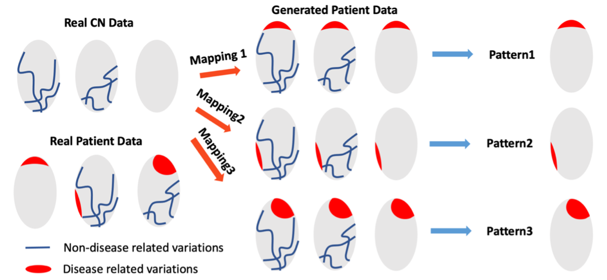

# Smile-GAN
Smile-GAN is a semi-supervised clustering method which is designed to identify disease-related heterogeneity among the patient group. The model effectively avoid variations among normal control (CN) group and cluster patient based on disease related variations only. Semi-supervised clustering of Smile-GAN is achieved through joint training of the mapping and clustering function, where the mapping function can map CN subjects along different mapping directions depending on disease-related variations.



## License
Copyright (c) 2016 University of Pennsylvania. All rights reserved. See[ https://www.cbica.upenn.edu/sbia/software/license.html](https://www.cbica.upenn.edu/sbia/software/license.html)

## Installation
We highly recommend the users to install **Anaconda3** on your machine. After installing Anaconda3, Smile-GAN can be used following this procedure:

We recommend the users to use the Conda virtual environment:

```bash
$ conda create --name smilegan python=3.8
```
Activate the virtual environment

```bash
$ conda activate smilegan
```
Install SmileGAN from PyPi:

```bash
$ pip install SmileGAN
```


## Input structure
Main functions of SmileGAN basically takes two panda dataframes as data inputs, **data** and **covariate** (optional). Columns with name *'participant_id'* and *diagnosis* must exist in both dataframes. Some conventions for the group label/diagnosis: -1 represents healthy control (CN) and 1 represents patient (PT); categorical variables, such as sex, should be encoded to numbers: Female for 0 and Male for 1, for example. 

Example for **data**:

```bash
participant_id    diagnosis    ROI1    ROI2 ...
subject-1	    -1         325.4   603.4
subject-2            1         260.5   580.3
subject-3           -1         326.5   623.4
subject-4            1         301.7   590.5
subject-5            1	       293.1   595.1
subject-6            1         287.8   608.9
```
Example for **covariate**

```bash
participant_id    diagnosis    age    sex ...
subject-1	    -1         57.3   0
subject-2 	     1         43.5   1
subject-3           -1         53.8   1
subject-4            1         56.0   0
subject-5            1	       60.0   1
subject-6            1         62.5   0
```

## Example
We offer a toy dataset in the folder of SmileGAN/dataset.

**Runing SmileGAN for clustering CN vs Subtype1 vs Subtype2 vs ...**

```bash
import pandas as pd
from SmileGAN.Smile_GAN_clustering import single_model_clustering, cross_validated_clustering, clustering_result

train_data = pd.read_csv('train_roi.csv')
covariate = pd.read_csv('train_cov.csv')

output_dir = "PATH_OUTPUT_DIR"
ncluster = 3
start_saving_epoch = 9000
max_epoch = 14000

## three parameters for stopping threshold
WD = 0.11
AQ = 20
cluster_loss = 0.0015

## one parameter for consensus method
consensus_type = "highest_matching_clustering"
```

When using the package, ***WD***, ***AQ***, ***cluster\_loss***, ***consensus\_type*** need to be chosen empirically:

***WD***: Wasserstein Distance measures the distance between generated PT data along each direction and real PT data. (**Recommended value**: 0.11-0.14)

***AQ***: Alteration Quantity measures the number of participants who change cluster labels during last three traninig epochs. Low AQ implies convergence of training. (**Recommended value**: 1/20 of PT sample size)

***cluster\_loss***: Cluster loss measures how well clustering function reconstruct sampled Z variable. (**Recommended value**: 0.0015-0.002)

***consensus\_type***: Consensus_type need to be chosen from **"consensus\_clustering"** and **"highest\_matching\_clustering"**. It determines how the final consensus result is derived from k clustering results obtained through the k-fold hold-out CV procedure. **"highest\_matching\_clustering"** is recommended if Adjusted Random Index among k clustering results is greater than 0.3. Otherwise, **"consensus\_clustering"** might give more reliable consensus results. User can always use function **clustering\_result**, trained models and a different consensus\_type to rederive results with different consensus\_type without retraining.

Some other parameters, ***lam***, ***mu***, ***batch\_size***, have default values but need to be changed in some cases:

***batch\_size***: Size of the batch for each training epoch. (Default to be 25) It is **necessary** to be reset to 1/10 - 1/20 of the PT sample size.

***lam***: coefficient controlling the relative importance of cluster\_loss in training objective function. (Default to be 9) 

***mu***: coefficient controlling the relative importance of change\_loss in training objective function. (Default to be 5). Can be reset to 5.5 or 6 if PT and CN does not have great differences and cluster\_loss does not converge during training procedure. 


```bash
single_model_clustering(train_data, ncluster, start_saving_epoch, max_epoch,\
					    output_dir, WD, AQ, cluster_loss, covariate=covariate)
```
**single\_model\_clustering** performs clustering without cross validation. Since only one model is trained with this function, the model may be not representative or reproducible. Therefore, this function is ***not recommended***. The function automatically saves an csv file with clustering results and returns the same dataframe.


```bash				    
fold_number = 10  # number of folds the leave-out cv runs
data_fraction = 0.8 # fraction of data used in each fold
cross_validated_clustering(train_data, ncluster, fold_number, data_fraction, start_saving_epoch, max_epoch,\
					    output_dir, WD, AQ, cluster_loss, consensus_tpype, covariate=covariate)
```

**cross\_validated\_clustering** performs clustering with leave-out cross validation. It is the ***recommended*** function for clustering. Since the CV process may take long training time on a normal desktop computer, the function enables early stop and later resumption. Users can set ***stop\_fold*** to be early stopping point and ***start\_fold*** depending on previous stopping point. The function automatically saves an csv file with clustering results and returns the same dataframe.

```					    
model_dirs = ['PATH_TO_CHECKPOINT1','PATH_TO_CHECKPOINT2',...] #list of paths to previously saved checkpoints (with name 'converged_model_foldk' after cv process)
cluster_label, cluster_probabilities = clustering_result(model_dirs, 'highest_matching_clustering', train_data, covariate)
```
**clustering\_result** is a function used for clustering patient data using previously saved models. Input data and covariate (optional) should be panda dataframe with same format shown before. Only PT data (can be inside or outside of training set), for which the user want to derive cluster memberships, need to be provided with diagnoses set to be 1.  ***The function returns cluster labels of PT data following the order of PT in the provided dataframe.*** If ***consensus\_type*** is chosen to be ***'highest\_matching\_clustering***, probabilities of each cluster will also be returned. 


## Citation
If you use this package for research, please cite the following paper:


```bash
@article{yang2021BrainHeterogeneity,
author = {Yang, Zhijian and Nasrallah, Ilya M. and Shou, Haochang and Wen, Junhao and Doshi, Jimit and Habes, Mohamad and Erus, Guray and Abdulkadir, Ahmed and Resnick, Susan M. and Albert, Marilyn S. and Maruff, Paul and Fripp, Jurgen and Morris, John C. and Wolk, David A. and Davatzikos, Christos and {iSTAGING Consortium} and {Baltimore Longitudinal Study of Aging (BLSA)} and {Alzheimer’s Disease Neuroimaging Initiative (ADNI)}},
year = {2021},
month = {12},
pages = {},
title = {A deep learning framework identifies dimensional representations of Alzheimer’s Disease from brain structure},
volume = {12},
journal = {Nature Communications},
doi = {10.1038/s41467-021-26703-z}
}
```


